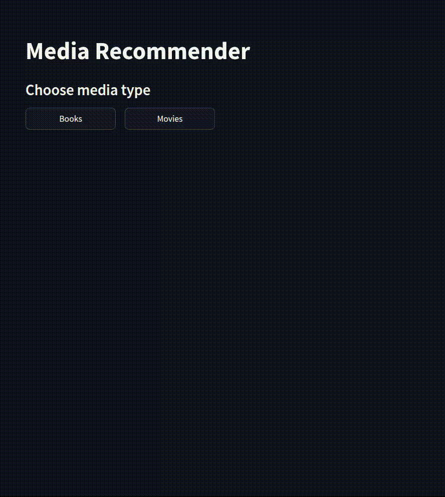

# Media Recommender

**Try the app yourself here**: [https://media-recommenders.streamlit.app/](https://media-recommenders.streamlit.app/) \
(Please keep in mind that if you're unlucky and open the app when it's not up, loading the model will take a while)

---

## Overview

This project is a **Book/Movie Recommendation System** that gives suggestions based on:

- **Natural language descriptions** - users can describe what they're looking for.
- **Rated titles** - users can rate previously seen titles.

---

## Demo

<table>
  <tr>
    <td align="center"><h3>Book Recommendations from Ratings</h3></td>
    <td align="center"><h3>Movie Recommendations from Description</h3></td>
  </tr>
  <tr>
    <td align="center"></td>
    <td align="center"></td>
  </tr>
</table>

---

## Techniques Used

### Embedding-Based Recommendation

- **SentenceTransformer (`all-MiniLM-L6-v2`)** is used to embed features of books and movies.
- Features are constructed from:
  - For books: tags, title, and author
  - For movies: genres, keywords, tagline, and overview
- **Cosine similarity** determines nearest neighbors for recommendations.

### Caching and Deployment

- Embeddings are precomputed and cached using `.npy` files to reduce startup and inference time.
- The model and embeddings are loaded **once per server** for efficient cloud deployment.
- The App is deployed on the **Streamlit Cloud**

### GUI

- Built with **Streamlit** for a lightweight interface

---

## Data Sources

- **Books**: [Zygmunt's Goodbooks-10k dataset](https://www.kaggle.com/datasets/zygmunt/goodbooks-10k)
- **Movies**: [TMDB 5000 Movie Dataset](https://www.kaggle.com/datasets/tmdb/tmdb-movie-metadata)

---

## Core Technologies

- `SentenceTransformer` (Hugging Face)
- `scikit-learn` (cosine similarity)
- `Streamlit` (GUI)
- `RapidFuzz` (fuzzy title matching)
- `KaggleHub` (remote dataset access)

---

## Running Locally

1. Clone the repository

```bash
git clone https://github.com/Infinity080/media-recommender.git
cd media-recommender
```

2. Install dependencies

```bash
python3 -m venv venv
source venv/bin/activate
```

```bash
pip install -r requirements.txt
```

3. Run the app

```bash
streamlit run app.py
```

## License

All data used is from publicly shared Kaggle datasets. SentenceTransformer models are under Apache 2.0 license via Hugging Face.

---
